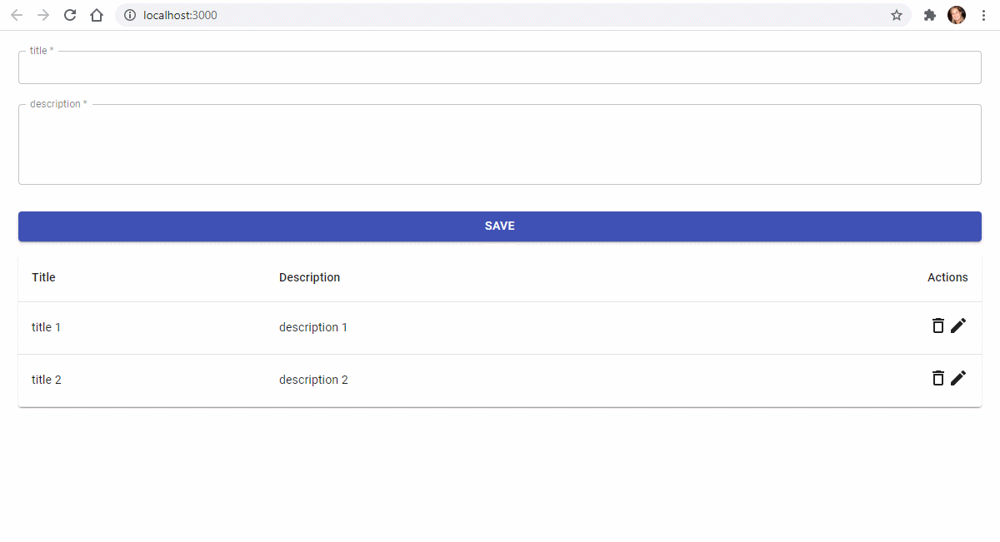

# Exercício de CRUD usando redux toolkit

## Bibliotecas usadas:
-   Redux-Saga: https://redux-saga.js.org/
-   React Hook Form: https://react-hook-form.com/
-   MATERIAL-UI: https://material-ui.com/

